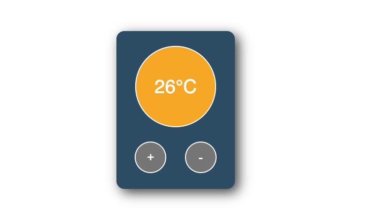

# TEMPURATURE APP

In this project I have built a temperature control app where the user can increase and decrease the temperature by clicking the respective buttons. The background color will change accordingly. Give it a try!

## Topics covered:

- React Hooks
- onClick event handlers
- useState()
- template literals
- if else statements
- changing CSS state

